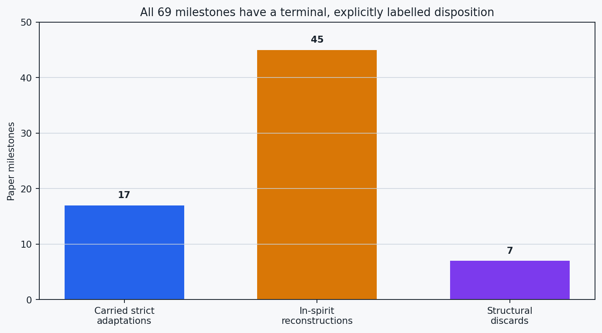
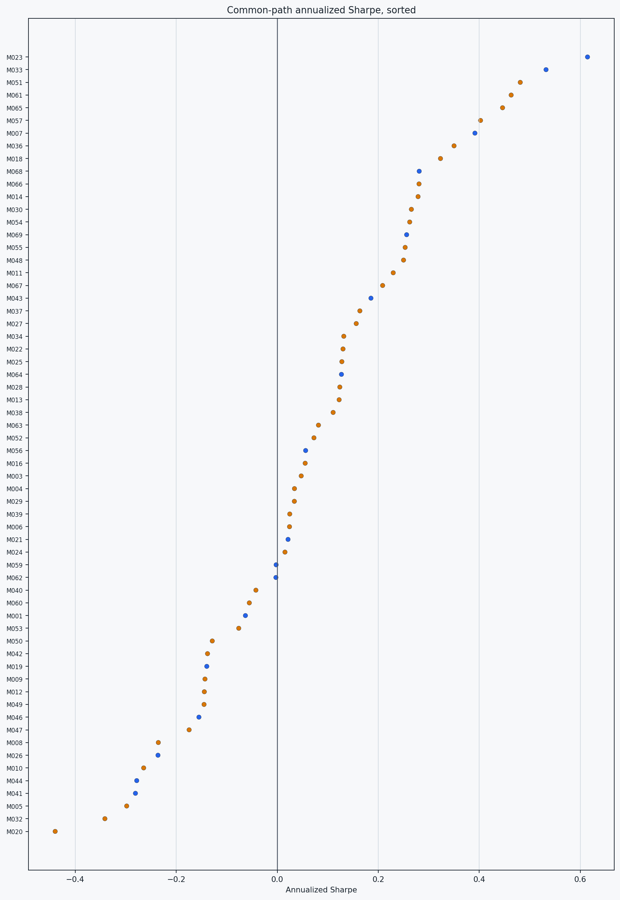
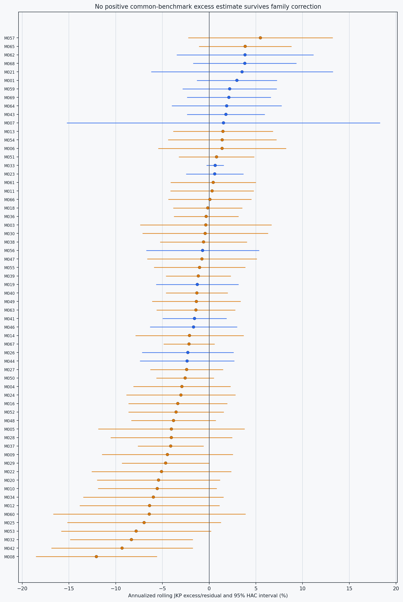
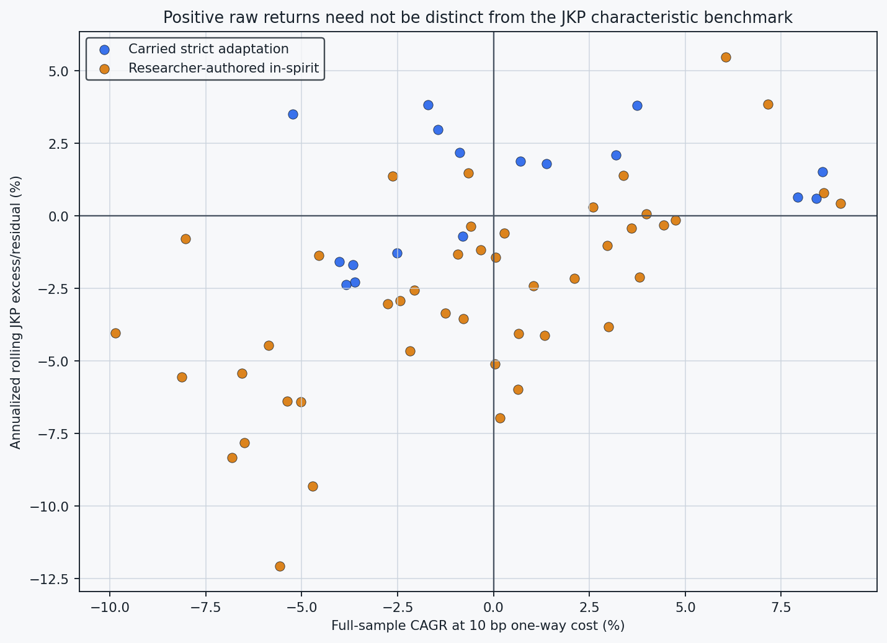

# Final 69-paper U.S./JKP reconstruction synthesis

## Executive answer

The milestone program is complete: **17 carried source-anchored common evaluations, 45 researcher-authored in-spirit reconstructions, and 7 structural discards**. That yields 62 executable monthly U.S.-stock paths on the same 305-month universe and accounting contract.

At the fixed 10 bp one-way cost, 29 of 62 paths have positive full-sample CAGR. After rolling reconstruction from the broad JKP characteristic benchmark, 20 have positive annualized excess/residual estimates. 4 have two-sided HAC p-values below 5% (0 positive), and 1 survives Holm's 69-paper family correction.

The honest interpretation is neither blanket A nor blanket B. We did **not** reproduce any paper's complete native system and empirical protocol end to end, so these results cannot declare the original claims true or false. For 17 cases we carried the strict study's best source-anchored adaptation or central component. For 45 cases we deliberately wrote a transparent surrogate preserving the headline mechanism. Their common JKP performance asks whether that implementation transfers; it is not a native replication test.

Every reconstruction was frozen before its own result and retained when negative or insignificant. Nevertheless this is retrospective research: prior project outcomes were known, and the 45 surrogates contain disclosed researcher choices. Treat the table as an auditable apples-to-apples comparison, not a pristine discovery holdout.

## 1. Final disposition



| Disposition | Papers | Common paths | Native claim tested? |
|---|---:|---:|---|
| Carried strict adaptation | 17 | 17 | No |
| Researcher-authored in-spirit | 45 | 45 | No |
| Structural discard | 7 | 0 | No |

[Full 69-paper audit table](visual_tables/complete_results_full_audit.csv)

## 2. Raw common-path performance

Sharpe ratios below are descriptive full-path outcomes after the common 10 bp cost. They do not measure fidelity to each paper's original reported universe or execution.



| ID | Class | CAGR | Sharpe | JKP excess/yr | raw p |
|---|---|---:|---:|---:|---:|
| M023 | carried_strict_adaptation | 8.41% | 0.614 | 0.60% | 0.7036 |
| M033 | carried_strict_adaptation | 7.93% | 0.532 | 0.65% | 0.1725 |
| M051 | researcher_authored_in_spirit | 8.61% | 0.481 | 0.80% | 0.6995 |
| M061 | researcher_authored_in_spirit | 9.05% | 0.463 | 0.44% | 0.8507 |
| M065 | researcher_authored_in_spirit | 7.15% | 0.446 | 3.86% | 0.1265 |
| ... | ... | ... | ... | ... | ... |
| M044 | carried_strict_adaptation | -3.84% | -0.278 | -2.36% | 0.3606 |
| M041 | carried_strict_adaptation | -4.03% | -0.281 | -1.56% | 0.3709 |
| M005 | researcher_authored_in_spirit | -9.85% | -0.298 | -4.04% | 0.3129 |
| M032 | researcher_authored_in_spirit | -6.82% | -0.341 | -8.32% | 0.0130 |
| M020 | researcher_authored_in_spirit | -6.55% | -0.440 | -5.41% | 0.1072 |

[Full metric audit](visual_tables/complete_results_full_audit.csv)

## 3. JKP benchmark attribution

The point is the estimated return left after a rolling reconstruction from the frozen broad JKP panel. Intervals are pointwise HAC intervals; family inference uses 69 planned papers.



| ID | Class | CAGR | Sharpe | JKP excess/yr | raw p |
|---|---|---:|---:|---:|---:|
| M057 | researcher_authored_in_spirit | 6.05% | 0.402 | 5.49% | 0.1647 |
| M065 | researcher_authored_in_spirit | 7.15% | 0.446 | 3.86% | 0.1265 |
| M062 | carried_strict_adaptation | -1.71% | -0.003 | 3.84% | 0.3036 |
| M068 | carried_strict_adaptation | 3.73% | 0.281 | 3.82% | 0.1759 |
| M021 | carried_strict_adaptation | -5.24% | 0.021 | 3.52% | 0.4776 |
| ... | ... | ... | ... | ... | ... |
| M025 | researcher_authored_in_spirit | 0.17% | 0.128 | -6.96% | 0.0973 |
| M053 | researcher_authored_in_spirit | -6.49% | -0.076 | -7.81% | 0.0562 |
| M032 | researcher_authored_in_spirit | -6.82% | -0.341 | -8.32% | 0.0130 |
| M042 | researcher_authored_in_spirit | -4.71% | -0.138 | -9.32% | 0.0158 |
| M008 | researcher_authored_in_spirit | -5.58% | -0.235 | -12.06% | 0.0003 |

[Full family-inference audit](visual_tables/family_inference_full_audit.csv)

## 4. Raw return versus benchmark distinctness



| Evaluation class | Paths | Positive CAGR | Positive JKP excess | raw p < 5% |
|---|---:|---:|---:|---:|
| Carried strict adaptations | 17 | 7 | 11 | 0 |
| In-spirit reconstructions | 45 | 22 | 9 | 4 |
| All evaluated | 62 | 29 | 20 | 4 |

[Full class summary](visual_tables/evaluation_class_summary_full_audit.csv)

## 5. Fidelity and claim boundary

- **Carried strict adaptations (17):** executable, source-anchored common paths already closed by the strict study. Labels such as `completed_partial` remain intact.
- **In-spirit reconstructions (45):** researcher-authored deterministic or chronological substitutions. Each recipe lists preserved, approximated, and invented elements.
- **Structural discards (7):** crypto, commodity-ETF, intraday, event-policy, or fixed daily-RL tasks whose central action geometry is not monthly cross-sectional U.S. stock selection.
- **Native empirical claims (69):** none is adjudicated by this transfer study. Prior dossiers may verify formulas, source components, author outputs, or individual cells, but zero complete native systems were reproduced end to end under their original protocols.

## 6. Metric contract

| Item | Fixed definition |
|---|---|
| Universe | Top 1,000 U.S. stocks by formation market equity each month |
| Calendar | July 1999 formations through November 2024; 305 realized months |
| Portfolio | Value-weighted long/short signal deciles unless a source-specific adapter feeds that score |
| Primary costs | 10 bp per one-way traded notional |
| Missing returns | Zero without reweighting; adverse -100% path retained as sensitivity |
| JKP attribution | Frozen rolling broad-characteristic reconstruction; 185-month evaluation window |
| Multiplicity | Holm over the declared 69-paper family; discarded papers remain missing, not zero |

[Complete metric and lineage audit](visual_tables/complete_results_full_audit.csv)

## 7. Reproducibility and artifact index

| Role | Artifact |
|---|---|
| Canonical 69-row result table | `visual_tables/complete_results_full_audit.csv` |
| Ordered multiple-testing table | `visual_tables/family_inference_full_audit.csv` |
| Evaluation-class counts | `visual_tables/evaluation_class_summary_full_audit.csv` |
| Figure-first report | `VISUAL_REPORT.md` |
| Table-first report | `REPORT.md` |
| Hash and lineage manifest | `final_manifest.json` |

Rebuild and validate from the repository root:

```bash
python scripts/build_us_jkp_in_spirit_final.py
python scripts/validate_us_jkp_in_spirit_final.py
```
